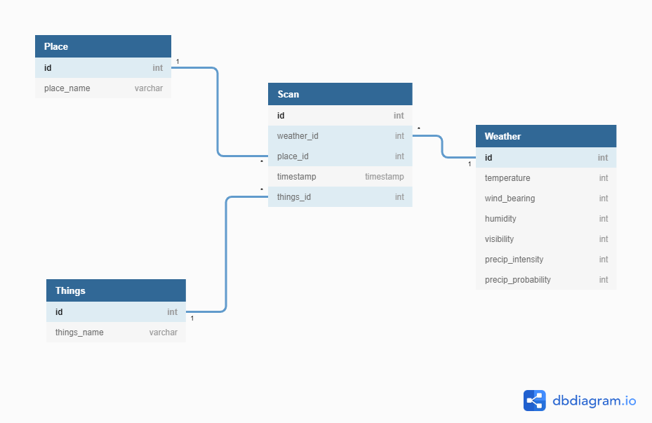

# BI_smart_home_dataset

| Listes des appareils | Conditions méteo | Liste des lieux|
| --------- | --------- | -----:|
| Solar | Temperature_far | Barn |
| Dishwasher  | Temperature_cel | Well |
| Furnace1  | Humidity | Living Room |
| Furnace2  | Visibility |
| Home Office  | Summary |
| Fridge  | ApparentTemperature_far |
| Wine cellar  | ApparentTemperature_cel |
| Garage Door  | Pressure |
| kitchen 12  | WindSpeed |
| Kitchen 14  | CloudCover |
| Kitchen 38  | WindBearing |
| MicroWave  | PrecipIntensity |
|   | PrecipProbability |
|   | DewPoint |

- [x] Convertion en classeur Excel

- [x] Nettoyer les données
  -[x] Suppression de la colonnes  House overall » et calcul de la colonne « real use »
  -[x] Suppression de la colonne « gen » qui est la meme donnée que celle de l'appareil «Solar»
  
- [x] Normaliser les chiffres à virgules
    - [x] Pour les données météos
    - [x] Pour les conso des appareils
    
- [ ] Créer un diagramme 
    - [x] Séparer par différentes feuilles les données
    - [x] Etablier les liens entre les feuilles
    - [ ] Valider le schéma
    
- [ ] Etablir des mesures
    - [ ] KPI 1
    - [ ] KPI 2
    
  
